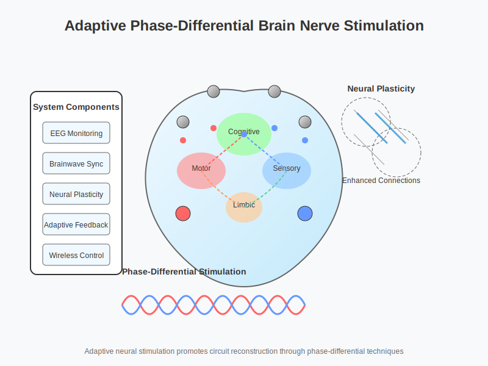

# Adaptive Phase-Differential Brain Nerve Stimulation System

A comprehensive framework for neural circuit reconstruction and functional recovery through adaptive phase-differential stimulation techniques.

  

## Overview

The Adaptive Phase-Differential Brain Nerve Stimulation System represents a cutting-edge approach to treating neurological disorders by precisely targeting and reorganizing neural circuits. By utilizing advanced algorithms that synchronize with the brain's natural rhythms, this system provides personalized, adaptive stimulation that enhances neuroplasticity and promotes functional recovery.

## Key Features

- **Real-time Brainwave Synchronization**: Delivers stimulation precisely timed to the user's brain activity patterns
- **Neuroplasticity Window Detection**: Automatically identifies optimal timing for stimulation to maximize therapeutic effects
- **Complex Spatiotemporal Patterns**: Creates sophisticated stimulation sequences that follow natural neural pathways
- **Neural Feedback Adaptation**: Continuously adjusts stimulation based on real-time neural responses
- **Wireless Multi-site Stimulation**: Enables flexible placement of stimulation devices for targeted therapy
- **Condition-Specific Protocols**: Specialized stimulation patterns for different neurological and psychiatric conditions

## How It Works

### Brainwave Synchronization

  

### Spatiotemporal Stimulation

  

### Adaptive Feedback Loop

  

## Applications

This system has potential applications across multiple neurological and psychiatric conditions:

  

- **Stroke Rehabilitation**: Promoting motor recovery through targeted cortical reorganization
- **Cognitive Enhancement**: Improving memory, attention, and executive functions via synchronized stimulation
- **Epilepsy Management**: Modulating aberrant neural circuits to reduce seizure frequency and severity
- **Dementia Intervention**: Enhancing cognitive function and slowing decline in neurodegenerative conditions
- **Depression Treatment**: Modulating mood-related neural networks through adaptive stimulation
- **Traumatic Brain Injury**: Supporting neural reorganization during recovery

## Repository Structure

- `src/`: Source code for the system implementation
- `doc/`: Comprehensive documentation
- `deployment/`: Deployment configurations and tools
- `Scientific_papers/`: Relevant scientific literature and references

## Technology

The system combines multiple technologies to achieve its therapeutic goals:

- Multi-channel EEG for real-time brain activity monitoring
- Wireless electrostimulation devices with programmable parameters
- Advanced signal processing algorithms for feature extraction
- Machine learning models for adaptive parameter optimization
- Secure cloud connectivity for data analysis and monitoring

## Getting Started

Please refer to the documentation in the `doc/` directory for installation instructions, user guides, and technical specifications.

Patent Pending
